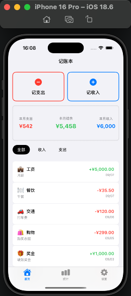
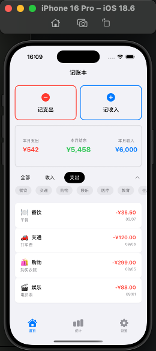
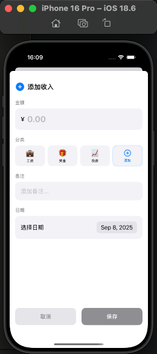

# app-jishang

## ScreenShot

## Tricks

### 为应用添加权限

配置Info.plist文件

1. 打开Info.plist文件：
在Xcode项目导航器中找到你的项目文件，选择Info.plist文件。

2. 添加权限键：
右键单击空白处，选择“添加新行”。

3. 输入键名：
输入对应的权限键，例如：
相机权限:Privacy - Camera Usage Description
定位权限（使用中）:Privacy - Location When In Use Usage Description
相册权限:Privacy - Photo Library Usage Description
麦克风权限:Privacy - Microphone Usage Description

4. 输入权限说明：
在值（Value）列输入清晰、用户友好的文本，解释你的应用程序为什么需要此权限。

### 无开发者权限打包 .ipa

XCode -> Product -> Archive -> 右键打包内容 -> Show in Finder -> 右键显示包内容 -> Products -> Applications

改成

Payload -> 压缩 Payload.zip -> Payload.ipa

